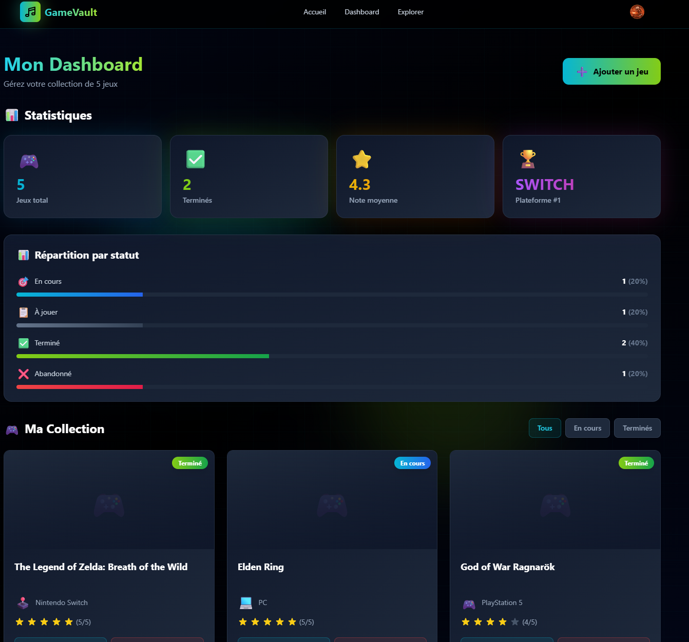
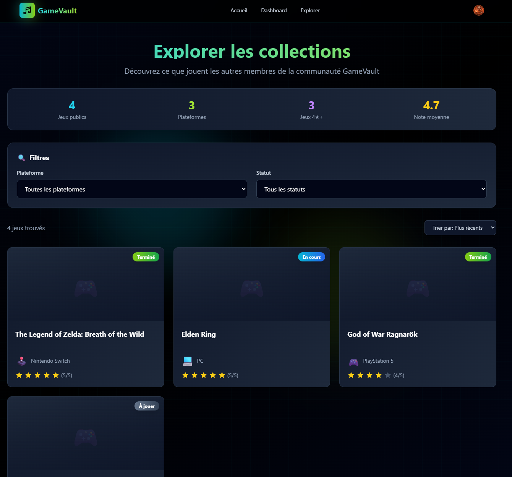
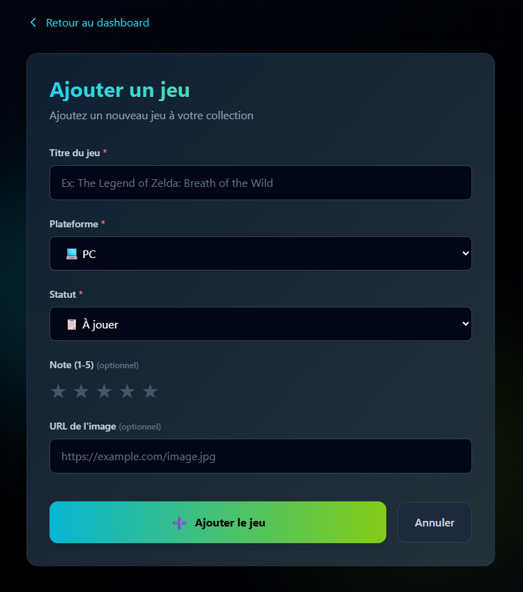

# 🎮 GameVault

Simon Hetu, Théo Winter, Alexandre Leblanc

GameVault est une application web permettant aux joueurs de gérer leur bibliothèque de jeux vidéo. Suivez votre progression, notez vos jeux favoris et découvrez ce que jouent les autres gamers — tout en un seul endroit.

## Description du projet

GameVault offre les fonctionnalités suivantes :

- **Gestion de collection** — Ajoutez des jeux à votre bibliothèque personnelle avec leur plateforme (PC, PS5, Xbox, Switch, Mobile, Autre).
- **Suivi de progression** — Marquez vos jeux comme *À jouer*, *En cours*, *Terminé* ou *Abandonné*.
- **Notation** — Attribuez une note à chaque jeu terminé.
- **Exploration** — Parcourez les collections publiques des autres utilisateurs.
- **Commentaires** — Laissez des commentaires sur les profils des autres joueurs.
- **Authentification** — Inscription et connexion sécurisées via Clerk.

### Technologies utilisées

| Catégorie | Technologie |
|---|---|
| Framework | Next.js 15 (App Router) |
| Langage | TypeScript |
| Style | Tailwind CSS |
| Base de données | PostgreSQL (Neon) |
| ORM | Prisma |
| Authentification | Clerk |

## Instructions d'installation et de lancement

### Prérequis

- [Node.js](https://nodejs.org/) (v18+)
- Un compte [Neon](https://neon.tech/) (base de données PostgreSQL)
- Un compte [Clerk](https://clerk.com/) (authentification)

### Installation

1. **Cloner le dépôt**

   ```bash
   git clone https://github.com/SimonHetu/Game-Vault.git
   cd Game-Vault
   ```

2. **Installer les dépendances**

   ```bash
   npm install
   ```

3. **Configurer les variables d'environnement**

   Créez un fichier `.env` à la racine du projet avec les variables suivantes :

   ```env
   DATABASE_URL="votre_url_neon_postgresql"

   NEXT_PUBLIC_CLERK_PUBLISHABLE_KEY="votre_clé_publique_clerk"
   CLERK_SECRET_KEY="votre_clé_secrète_clerk"

   NEXT_PUBLIC_CLERK_SIGN_IN_URL="/sign-in"
   NEXT_PUBLIC_CLERK_SIGN_UP_URL="/sign-up"
   ```

4. **Appliquer les migrations Prisma**

   ```bash
   npx prisma migrate deploy
   ```

5. **Générer le client Prisma**

   ```bash
   npx prisma generate
   ```

### Lancement

```bash
npm run dev
```

L'application sera accessible à l'adresse [http://localhost:3000](http://localhost:3000).

### Autres commandes

| Commande | Description |
|---|---|
| `npm run build` | Compile l'application pour la production |
| `npm run start` | Démarre le serveur de production |
| `npm run lint` | Vérifie le code avec ESLint |




